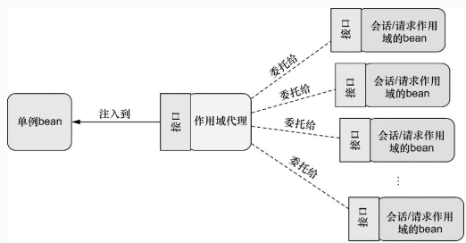

在默认情况下，Spring应用上下文中所有bean都是作为以**单例（singleton）**的形式创建的。也就是说，不管给定的一个bean被注入到其他bean多少次，每次所注入的都是**同一个实例**。

在大多数情况下，单例bean是很理想的方案。初始化和垃圾回收对象实例所带来的成本只留给一些小规模任务，在这些任务中，让对象保持无状态并且在应用中反复重用这些对象可能并不合理。

有时候，可能会发现，你所使用的类是**易变的（mutable）**，它们会保持一些状态，因此重用是不安全的。在这种情况下，将class声明为单例的bean就不是什么好主意了，因为对象会被污染，稍后重用的时候会出现意想不到的问题。

Spring定义了多种作用域，可以基于这些作用域创建bean，包括：

- **单例（Singleton）**：在整个应用中，只创建bean的一个实例。
- **原型（Prototype）**：每次注入或者通过Spring应用上下文获取的时候，都会创建一个新的bean实例。
- **会话（Session）**：在Web应用中，为每个会话创建一个bean实例。
- **请求（Rquest）**：在Web应用中，为每个请求创建一个bean实例。

单例是默认的作用域，但是正如之前所述，对于易变的类型，这并不合适。如果选择其他的作用域，要使用**@Scope**注解，它可以与**`@Component`**或**`@Bean`**一起使用。

例如，如果你使用组件扫描来发现和声明bean，那么你可以在bean的类上使用*`*@Scope`**注解，将其声明为原型bean：

```java
@Component
@Scope(ConfigurableBeanFactory.SCOPE_PROTOTYPE)
public class Notepad { ... }
```

这里，使用**`ConfigurableBeanFactory`**类的**`SCOPE_PROTOTYPE`**常量设置了原型作用域。你当然也可以使用**`@Scope("prototype")`**，但是使用**`SCOPE_PROTOTYPE`**常量更加安全并且不易出错。

如果你想在Java配置中将Notepad声明为原型bean，那么可以组合使用`@Scope`和`@Bean`来指定所需的作用域：

```java
@Bean
@Scope(ConfigurableBeanFactory.SCOPE_PROTOTYPE)
public Notepad notepad() {
  return new Notepad();
}
```

同样，如果你使用XML来配置bean的话，可以使用**`<bean>`**元素的**`scope`**属性来设置作用域：

```xml
<bean id="notepad"
      class="com.myapp.Notepad"
      scope="prototype" />
```

不管你使用哪种方式来声明原型作用域，每次注入或从Spring应用上下文中检索该bean的时候，都会创建新的实例。这样所导致的结果就是每次操作都能得到自己的Notepad实例。

## 1 使用会话和请求作用域

在Web应用中，如果能够实例化在**会话和请求范围**内共享的bean，那将是非常有价值的事情。例如，在典型的电子商务应用中，可能会有一个bean代表`用户的购物车`。如果购物车是单例的话，那么将会导致所有的用户都会向同一个购物车中添加商品。另一方面，如果购物车是原型作用域的，那么在应用中某一个地方往购物车中添加商品，在应用的另外一个地方可能就不可用了，因为在这里注入的是另外一个原型作用域的购物车。

就购物车bean来说，`会话作用域`是最为合适的，因为它`与给定的用户`关联性最大。要指定会话作用域，我们可以使用**`@Scope`**注解，它的使用方式与指定原型作用域是相同的：

```java
@Component
@Scope(
    value=WebApplicationContext.SCOPE_SESSION,
    proxyMode=ScopedProxyMode.INTERFACES)
public ShoppingCart cart() { ... }
```

这里，我们将value设置成了WebApplicationContext中的SCOPE_SESSION常量（它的值是session）。这会告诉Spring为Web应用中的每个会话创建一个ShoppingCart。这会创建多个ShoppingCart bean的实例，但是对于给定的会话只会创建一个实例，在当前会话相关的操作中，这个bean实际上相当于单例的。

要注意的是，**`@Scope`**同时还有一个**`proxyMode`**属性，它被设置成了**`ScopedProxyMode.INTERFACES`**。这个属性解决了将会话或请求作用域的bean注入到单例bean中所遇到的问题。在描述proxyMode属性之前，我们先来看一下proxyMode所解决问题的场景。

假设我们要将ShoppingCart bean注入到单例StoreService bean的Setter方法中，如下所示：

```java
@Component
public class StoreService {

  @Autowired
  public void setShoppingCart(ShoppingCart shoppingCart) {
    this.shoppingCart = shoppingCart;
  }
  ...
}
```

因为StoreService是一个单例的bean，会在Spring应用上下文加载的时候创建。当它创建的时候，Spring会试图将ShoppingCart bean注入到setShoppingCart()方法中。但是ShoppingCart bean是**`会话作用域`**的，此时并不存在。直到某个用户进入系统，创建了会话之后，才会出现ShoppingCart实例。

另外，系统中将会有多个ShoppingCart实例：**`每个用户一个`**。我们并不想让Spring注入某个固定的ShoppingCart实例到StoreService中。我们希望的是当StoreService处理购物车功能时，它所使用的ShoppingCart实例恰好是当前会话所对应的那一个。

Spring**`并不会`**将实际的ShoppingCart bean注入到StoreService中，Spring会注入一个到**`ShoppingCart bean的代理`**，如图3.1所示。这个代理会暴露与ShoppingCart相同的方法，所以StoreService会认为它就是一个购物车。但是，当StoreService调用ShoppingCart的方法时，代理会对其进行**`懒解析`**并将调用**`委托`**给会话作用域内真正的ShoppingCart bean。

现在，我们带着对这个作用域的理解，讨论一下proxyMode属性。如配置所示，proxyMode属性被设置成了ScopedProxyMode.INTERFACES，这**`表明这个代理要实现ShoppingCart接口`**，并将调用委托给实现bean。

如果ShoppingCart是接口而不是类的话，这是可以的（也是最为理想的代理模式）。但如果ShoppingCart是一个具体的类的话，Spring就没有办法创建基于接口的代理了。此时，它必须使用**`CGLib`**来生成**`基于类的代理`**。所以，如果bean类型是具体类的话，我们必须要将proxyMode属性设置为**`ScopedProxyMode.TARGET_CLASS`**，以此来表明要以生成目标类扩展的方式创建代理。

尽管我主要关注了会话作用域，但是请求作用域的bean会面临相同的装配问题。因此，请求作用域的bean应该也以作用域代理的方式进行注入。



图3.1　作用域代理能够延迟注入请求和会话作用域的bean

## 2 在XML中声明作用域代理

如果你需要使用XML来声明会话或请求作用域的bean，那么就不能使用@Scope注解及其proxyMode属性了。**`<bean>`**元素的**`scope属性`**能够设置bean的作用域，但是该怎样指定代理模式呢？

要设置代理模式，我们需要使用Spring aop命名空间的一个新元素：

```xml
<bean id="cart"
      class="com.myapp.ShoppingCart"
      scope="session">
  <aop:scoped-proxy />
</bean>
```

**`<aop:scoped-proxy>`**是与**`@Scope`**注解的proxyMode属性功能相同的Spring XML配置元素。它会告诉Spring为bean创建一个作用域代理。默认情况下，它会**`使用CGLib创建目标类的代理`**。但是我们也可以将**`proxy-target-class`**属性设置为false，进而要求它生成基于接口的代理：

```xml
<bean id="cart"
      class="com.myapp.ShoppingCart"
      scope="session">
  <aop:scoped-proxy proxy-target-class="false" />
</bean>
```

为了使用**`<aop:scoped-proxy>`**元素，我们必须在XML配置中声明Spring的aop命名空间：

```xml
<?xml version="1.0" encoding="UTF-8"?>
<beans xmlns="http://www.springframework.org/schema/beans"
  xmlns:xsi="http://www.w3.org/2001/XMLSchema-instance"
  xmlns:aop="http://www.springframework.org/schema/aop"
  xsi:schemaLocation="
    http://www.springframework.org/schema/aop
    http://www.springframework.org/schema/aop/spring-aop.xsd
    http://www.springframework.org/schema/beans
    http://www.springframework.org/schema/beans/spring-beans.xsd">
...
</beans>
```