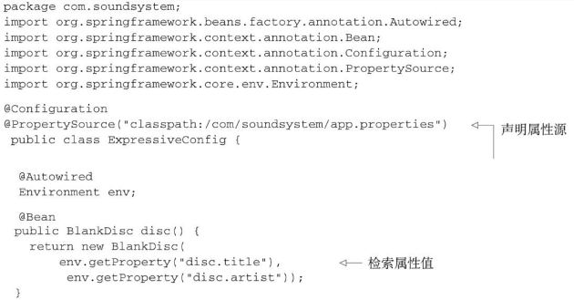

当讨论依赖注入的时候，我们通常所讨论的是将一个bean引用注入到另一个bean的属性或构造器参数中。它通常来讲指的是将一个对象与另一个对象进行关联。

但是bean装配的另外一个方面指的是将一个值注入到bean的属性或者构造器参数中。我们在第2章中已经进行了很多值装配，如将专辑的名字装配到BlankDisc bean的构造器或title属性中。例如，我们可能按照这样的方式来组装BlankDisc：

```java
@Bean
public CompactDisc sgtPeppers() {
  return new BlankDisc(
      "Sgt. Pepper's Lonely Hearts Club Band",
      "The Beatles");
}
```

尽管这实现了你的需求，也就是为BlankDisc bean设置title和artist，但它在实现的时候是将值硬编码在配置类中的。与之类似，如果使用XML的话，那么值也会是硬编码的：

```xml
<bean id="sgtPeppers"
      class="soundsystem.BlankDisc"
      c:_title="Sgt. Pepper's Lonely Hearts Club Band"
      c:_artist="The Beatles" />
```

有时候硬编码是可以的，但有的时候，我们可能会希望避免硬编码值，而是想让这些值在运行时再确定。为了实现这些功能，Spring提供了两种在运行时求值的方式：

- 属性占位符（Property placeholder）。
- Spring表达式语言（SpEL）。

很快你就会发现这两种技术的用法是类似的，不过它们的目的和行为是有所差别的。让我们先看一下属性占位符，在这两者中它较为简单，然后再看一下更为强大的SpEL。

## 1 注入外部的值

在Spring中，处理外部值的最简单方式就是声明属性源并通过Spring的Environment来检索属性。例如，程序清单3.7展现了一个基本的Spring配置类，它使用外部的属性来装配BlankDisc bean。



在本例中，@PropertySource引用了类路径中一个名为app.properties的文件。它大致会如下所示：

```plain
disc.title=Sgt. Peppers Lonely Hearts Club Band
disc.artist=The Beatles
```

这个属性文件会加载到Spring的Environment中，稍后可以从这里检索属性。同时，在disc()方法中，会创建一个新的BlankDisc，它的构造器参数是从属性文件中获取的，而这是通过调用getProperty()实现的。

### 深入学习Spring的Environment

当我们去了解Environment的时候会发现，程序清单3.7所示的getProperty()方法并不是获取属性值的唯一方法，getProperty()方法有四个重载的变种形式：

- **`String getProperty(String key)`**
- **`String getProperty(String key, String defaultValue)`**
- **`T getProperty(String key, Class<T> type)`**
- **`T getProperty(String key, Class<T> type, T defaultValue)`**

前两种形式的getProperty()方法都会返回String类型的值。我们已经在程序清单3.7中看到了如何使用第一种getProperty()方法。但是，你可以稍微对@Bean方法进行一下修改，这样在指定属性不存在的时候，会使用一个默认值：

```java
@Bean
public BlankDisc disc() {
return new BlankDisc(
    env.getProperty("disc.title", "Rattle and Hum"),
    env.getProperty("disc.artist", "U2"));
}
```

剩下的两种getProperty()方法与前面的两种非常类似，但是它们不会将所有的值都视为String类型。例如，假设你想要获取的值所代表的含义是连接池中所维持的连接数量。如果我们从属性文件中得到的是一个String类型的值，那么在使用之前还需要将其转换为Integer类型。但是，如果使用重载形式的getProperty()的话，就能非常便利地解决这个问题：

```java
int connectionCount =
    env.getProperty("db.connection.count", Integer.class, 30);
```

Environment还提供了几个与属性相关的方法，如果你在使用getProperty()方法的时候没有指定默认值，并且这个属性没有定义的话，获取到的值是null。如果你希望这个属性必须要定义，那么可以使用getRequiredProperty()方法，如下所示：

```java
@Bean
public BlankDisc disc() {
return new BlankDisc(
    env.getRequiredProperty("disc.title"),
    env.getRequiredProperty("disc.artist"));
}
```

在这里，如果disc.title或disc.artist属性没有定义的话，将会抛出IllegalStateException异常。

如果想检查一下某个属性是否存在的话，那么可以调用Environment的containsProperty()方法：

```java
boolean titleExists = env.containsProperty("disc.title");
```

最后，如果想将属性解析为类的话，可以使用getPropertyAsClass()方法：

```java
Class<CompactDisc> cdClass =
    env.getPropertyAsClass("disc.class", CompactDisc.class);
```

除了属性相关的功能以外，Environment还提供了一些方法来检查哪些profile处于激活状态：

- String[] getActiveProfiles()：返回激活profile名称的数组；
- String[] getDefaultProfiles()：返回默认profile名称的数组；
- boolean acceptsProfiles(String... profiles)：如果environment支持给定profile的话，就返回true。

在程序清单3.6中，我们已经看到了如何使用acceptsProfiles()。在那个例子中，Environment是从ConditionContext中获取到的，在bean创建之前，使用acceptsProfiles()方法来确保给定bean所需的profile处于激活状态。通常来讲，我们并不会频繁使用Environment相关的方法，但是知道有这些方法还是有好处的。

直接从Environment中检索属性是非常方便的，尤其是在Java配置中装配bean的时候。但是，Spring也提供了通过占位符装配属性的方法，这些占位符的值会来源于一个属性源。

### 解析属性占位符

Spring一直支持将属性定义到外部的属性的文件中，并使用占位符值将其插入到Spring bean中。在Spring装配中，占位符的形式为使用“${ ... }”包装的属性名称。作为样例，我们可以在XML中按照如下的方式解析BlankDisc构造器参数：

```xml
<bean id="sgtPeppers"
      class="soundsystem.BlankDisc"
      c:_title="${disc.title}"
      c:_artist="${disc.artist}" />
```

可以看到，title构造器参数所给定的值是从一个属性中解析得到的，这个属性的名称为disc.title。artist参数装配的是名为disc.artist的属性值。按照这种方式，XML配置没有使用任何硬编码的值，它的值是从配置文件以外的一个源中解析得到的。（我们稍后会讨论这些属性是如何解析的。）

如果我们依赖于组件扫描和自动装配来创建和初始化应用组件的话，那么就没有指定占位符的配置文件或类了。在这种情况下，我们可以使用@Value注解，它的使用方式与@Autowired注解非常相似。比如，在BlankDisc类中，构造器可以改成如下所示：

```java
public BlankDisc(
      @Value("${disc.title}") String title,
      @Value("${disc.artist}") String artist) {
  this.title = title;
  this.artist = artist;
}
```

为了使用占位符，我们必须要配置一个PropertyPlaceholderConfigurer bean或PropertySourcesPlaceholderConfigurer bean。从Spring 3.1开始，推荐使用PropertySourcesPlaceholderConfigurer，因为它能够基于Spring Environment及其属性源来解析占位符。

如下的@Bean方法在Java中配置了PropertySourcesPlaceholderConfigurer：

```java
@Bean
public
static PropertySourcesPlaceholderConfigurer placeholderConfigurer() {
  return new PropertySourcesPlaceholderConfigurer();
}
```

如果你想使用XML配置的话，Spring context命名空间中的**`<context:propertyplaceholder>`**元素将会为你生成PropertySourcesPlaceholderConfigurer bean：

```xml
<?xml version="1.0" encoding="UTF-8"?>
<beans xmlns="http://www.springframework.org/schema/beans"
  xmlns:xsi="http://www.w3.org/2001/XMLSchema-instance"
  xmlns:context="http://www.springframework.org/schema/context"
  xsi:schemaLocation="
    http://www.springframework.org/schema/beans
    http://www.springframework.org/schema/beans/spring-beans.xsd
    http://www.springframework.org/schema/context
    http://www.springframework.org/schema/context/spring-context.xsd">

  <context:property-placeholder />

</beans>
```

解析外部属性能够将值的处理推迟到运行时，但是它的关注点在于根据名称解析来自于Spring Environment和属性源的属性。而Spring表达式语言提供了一种更通用的方式在运行时计算所要注入的值。

## 2 使用Spring表达式语言进行装配

Spring 3引入了Spring表达式语言（Spring Expression Language，SpEL），它能够以一种强大和简洁的方式将值装配到bean属性和构造器参数中，在这个过程中所使用的表达式会在运行时计算得到值。使用SpEL，你可以实现超乎想象的装配效果，这是使用其他的装配技术难以做到的（甚至是不可能的）。

SpEL拥有很多特性，包括：

- 使用bean的ID来引用bean；
- 调用方法和访问对象的属性；
- 对值进行算术、关系和逻辑运算；
- 正则表达式匹配；
- 集合操作。

在本书后面的内容中你可以看到，SpEL能够用在依赖注入以外的其他地方。例如，Spring Security支持使用SpEL表达式定义安全限制规则。另外，如果你在Spring MVC应用中使用Thymeleaf模板作为视图的话，那么这些模板可以使用SpEL表达式引用模型数据。

作为起步，我们看几个SpEL表达式的样例，以及如何将其注入到bean中。然后我们会深入学习一些SpEL的基础表达式，它们能够组合起来形成更为强大的表达式。

### SpEL样例

SpEL是一种非常灵活的表达式语言，所以在本书中不可能面面俱到地介绍它的各种用法。但是我们可以展示几个基本的例子，这些例子会激发你的灵感，有助于你编写自己的表达式。

需要了解的第一件事情就是SpEL表达式要放到“#{ ... }”之中，这与属性占位符有些类似，属性占位符需要放到“${ ... }”之中。下面所展现的可能是最简单的SpEL表达式了：

```plain
#{1}
```

除去“#{ ... }”标记之后，剩下的就是SpEL表达式体了，也就是一个数字常量。这个表达式的计算结果就是数字1，这恐怕并不会让你感到丝毫惊讶。

当然，在实际的应用程序中，我们可能并不会使用这么简单的表达式。我们可能会使用更加有意思的表达式，如：

```plain
#{T(System).currentTimeMillis()}
```

它的最终结果是计算表达式的那一刻当前时间的毫秒数。T()表达式会将java.lang.System视为Java中对应的类型，因此可以调用其static修饰的currentTimeMillis()方法。

SpEL表达式也可以引用其他的bean或其他bean的属性。例如，如下的表达式会计算得到ID为sgtPeppers的bean的artist属性：

```plain
#{sgtPeppers.artist}
```

我们还可以通过systemProperties对象引用系统属性：

```plain
#{systemProperties['disc.title']}
```

这只是SpEL的几个基础样例。在本章结束之前，你还会看到很多这样的表达式。但是，在此之前，让我们看一下在bean装配的时候如何使用这些表达式。

如果通过组件扫描创建bean的话，在注入属性和构造器参数时，我们可以使用@Value注解，这与之前看到的属性占位符非常类似。不过，在这里我们所使用的不是占位符表达式，而是SpEL表达式。例如，下面的样例展现了BlankDisc，它会从系统属性中获取专辑名称和艺术家的名字：

```java
public BlankDisc(
      @Value("#{systemProperties['disc.title']}") String title,
      @Value("#{systemProperties['disc.artist']}") String artist) {
  this.title = title;
  this.artist = artist;
}
```

在XML配置中，你可以将SpEL表达式传入**`<property>`**或**`<constructor-arg>`**的value属性中，或者将其作为p-命名空间或c-命名空间条目的值。例如，在如下BlankDisc bean的XML声明中，构造器参数就是通过SpEL表达式设置的：

```xml
<bean id="sgtPeppers"
      class="soundsystem.BlankDisc"
      c:_title="#{systemProperties['disc.title']}"
      c:_artist="#{systemProperties['disc.artist']}" />
```

我们已经看过了几个简单的样例，也学习了如何将SpEL解析得到的值注入到bean中，那现在就来继续学习一下SpEL所支持的基础表达式吧。

### 表示字面值

我们在前面已经看到了一个使用SpEL来表示整数字面量的样例。它实际上还可以用来表示浮点数、String值以及Boolean值。

下面的SpEL表达式样例所表示的就是浮点值：

```plain
#{3.14159}
```

数值还可以使用科学记数法的方式进行表示。如下面的表达式计算得到的值就是98,700：

```plain
#{9.87E4}
```

SpEL表达式也可以用来计算String类型的字面值，如：

```plain
#{'Hello'}
```

最后，字面值true和false的计算结果就是它们对应的Boolean类型的值。例如：

```plain
#{false}
```

在SpEL中使用字面值其实没有太大的意思，毕竟将整型属性设置为1，或者将Boolean属性设置为false时，我们并不需要使用SpEL。我承认在SpEL表达式中，只包含字面值情况并没有太大的用处。但需要记住的一点是，更有意思的SpEL表达式是由更简单的表达式组成的，因此了解在SpEL中如何使用字面量还是很有用处的。当组合更为复杂的表达式时，你迟早会用到它们。

### 引用bean、属性和方法

SpEL所能做的另外一件基础的事情就是通过ID引用其他的bean。例如，你可以使用SpEL将一个bean装配到另外一个bean的属性中，此时要使用bean ID作为SpEL表达式（在本例中，也就是sgtPeppers）：

```plain
#{sgtPeppers}
```

现在，假设我们想在一个表达式中引用sgtPeppers的artist属性：

```plain
#{sgtPeppers.artist}
```

表达式主体的第一部分引用了一个ID为sgtPeppers的bean，分割符之后是对artist属性的引用。

除了引用bean的属性，我们还可以调用bean上的方法。例如，假设有另外一个bean，它的ID为artistSelector，我们可以在SpEL表达式中按照如下的方式来调用bean的selectArtist()方法：

```plain
#{artistSelector.selectArtist()}
```

对于被调用方法的返回值来说，我们同样可以调用它的方法。例如，如果selectArtist()方法返回的是一个String，那么可以调用toUpperCase()将整个艺术家的名字改为大写字母形式：

```plain
#{artistSelector.selectArtist().toUpperCase()}
```

如果selectArtist()的返回值不是null的话，这没有什么问题。为了避免出现NullPointerException，我们可以使用类型安全的运算符：

```plain
#{artistSelector.selectArtist()?.toUpperCase()}
```

与之前只是使用点号（.）来访问toUpperCase()方法不同，现在我们使用了“?.”运算符。这个运算符能够在访问它右边的内容之前，确保它所对应的元素不是null。所以，如果selectArtist()的返回值是null的话，那么SpEL将不会调用toUpperCase()方法。表达式的返回值会是null。

### 在表达式中使用类型

如果要在SpEL中访问类作用域的方法和常量的话，要依赖T()这个关键的运算符。例如，为了在SpEL中表达Java的Math类，需要按照如下的方式使用T()运算符：

```plain
T(java.lang.Math)
```

这里所示的T()运算符的结果会是一个Class对象，代表了**`java.lang.Math`**。如果需要的话，我们甚至可以将其装配到一个Class类型的bean属性中。但是T()运算符的真正价值在于它能够访问目标类型的静态方法和常量。

例如，假如你需要将PI值装配到bean属性中。如下的SpEL就能完成该任务：

```plain
T(java.lang.Math).PI
```

与之类似，我们可以调用T()运算符所得到类型的静态方法。我们已经看到了通过T()调用System.currentTimeMillis()。如下的这个样例会计算得到一个0到1之间的随机数：

```plain
T(java.lang.Math).random()
```

### SpEL运算符

SpEL提供了多个运算符，这些运算符可以用在SpEL表达式的值上。表3.1概述了这些运算符。

表3.1 用来操作表达式值的SpEL运算符

|运算符类型|运算符|
|---|---|
|算术运算|+、-、 * 、/、%、^|
|比较运算|< 、 > 、 == 、 <= 、 >= 、 lt 、 gt 、 eq 、 le 、 ge|
|逻辑运算|and 、 or 、 not 、│|
|条件运算|?: (ternary) 、 ?: (Elvis)|
|正则表达式|matches|

作为使用上述运算符的一个简单样例，我们看一下下面这个SpEL表达式：

```plain
#{2 * T(java.lang.Math).PI * circle.radius}
```

这不仅是使用SpEL中乘法运算符（*）的绝佳样例，它也为你展现了如何将简单的表达式组合为更为复杂的表达式。在这里PI的值乘以2，然后再乘以radius属性的值，这个属性来源于ID为circle的bean。实际上，它计算了circle bean中所定义圆的周长。

类似地，你还可以在表达式中使用乘方运算符（^）来计算圆的面积：

```plain
#{T(java.lang.Math).PI * circle.radius ^ 2}
```

“^”是用于乘方计算的运算符。在本例中，我们使用它来计算圆半径的平方。

当使用String类型的值时，“+”运算符执行的是连接操作，与在Java中是一样的：

```plain
#{disc.title + ' by ' + disc.artist}
```

SpEL同时还提供了比较运算符，用来在表达式中对值进行对比。注意在表3.1中，比较运算符有两种形式：符号形式和文本形式。在大多数情况下，符号运算符与对应的文本运算符作用是相同的，使用哪一种形式均可以。

例如，要比较两个数字是不是相等，可以使用双等号运算符（==）：

```plain
#{counter.total == 100}
```

或者，也可以使用文本型的eq运算符：

```plain
#{counter.total eq 100}
```

两种方式的结果都是一样的。表达式的计算结果是个Boolean值：如果counter.total等于100的话，为true，否则为false。

SpEL还提供了三元运算符（ternary），它与Java中的三元运算符非常类似。例如，如下的表达式会判断如果scoreboard.score>1000的话，计算结果为String类型的“Winner！”，否则的话，结果为Loser：

```plain
#{scoreboard.score > 1000 ? "Winner!" : "Loser"}
```

三元运算符的一个常见场景就是检查null值，并用一个默认值来替代null。例如，如下的表达式会判断disc.title的值是不是null，如果是null的话，那么表达式的计算结果就会是“Rattle and Hum”：

```plain
#{disc.title ?: 'Rattle and Hum'}
```

这种表达式通常称为Elvis运算符。这个奇怪名称的来历是，当使用符号来表示表情时，问号看起来很像是猫王（Elvis Presley）的头发。

### 计算正则表达式

当处理文本时，有时检查文本是否匹配某种模式是非常有用的。SpEL通过matches运算符支持表达式中的模式匹配。matches运算符对String类型的文本（作为左边参数）应用正则表达式（作为右边参数）。matches的运算结果会返回一个Boolean类型的值：如果与正则表达式相匹配，则返回true；否则返回false。

为了进一步解释matches运算符，假设我们想判断一个字符串是否包含有效的邮件地址。在这个场景下，我们可以使用matches运算符，如下所示：

```plain
#{admin.email matches '[a-zA-Z0-9._%+-]+@[a-zA-Z0-9.-]+\\.com'}
```

探寻正则表达式语法的秘密超出了本书的范围，同时我们也应该意识到这里的正则表达式还不足够健壮来涵盖所有的场景。但对于演示matches运算符的用法，这已经足够了。

计算集合
SpEL中最令人惊奇的一些技巧是与集合和数组相关的。最简单的事情可能就是引用列表中的一个元素了：

```plain
#{jukebox.songs[4].title}
```

这个表达式会计算songs集合中第五个（基于零开始）元素的title属性，这个集合来源于ID为jukebox bean。

为了让这个表达式更丰富一些，假设我们要从jukebox中随机选择一首歌：

```plain
#{jukebox.songs[T(java.lang.Math).random() *
                         jukebox.songs.size()].title}
```

“[]”运算符用来从集合或数组中按照索引获取元素，实际上，它还可以从String中获取一个字符。比如：

```plain
#{'This is a test'[3]}
```

这个表达式引用了String中的第四个（基于零开始）字符，也就是“s”。[2]

SpEL还提供了查询运算符（.?[]），它会用来对集合进行过滤，得到集合的一个子集。作为阐述的样例，假设你希望得到jukebox中artist属性为Aerosmith的所有歌曲。如下的表达式就使用查询运算符得到了Aerosmith的所有歌曲：

```plain
#{jukebox.songs.?[artist eq 'Aerosmith']}
```

可以看到，选择运算符在它的方括号中接受另一个表达式。当SpEL迭代歌曲列表的时候，会对歌曲集合中的每一个条目计算这个表达式。如果表达式的计算结果为true的话，那么条目会放到新的集合中。否则的话，它就不会放到新集合中。在本例中，内部的表达式会检查歌曲的artist属性是不是等于Aerosmith。

SpEL还提供了另外两个查询运算符：**`.^[]`**和**`.$[]`**，它们分别用来在集合中查询第一个匹配项和最后一个匹配项。例如，考虑下面的表达式，它会查找列表中第一个artist属性为Aerosmith的歌曲：

```plain
#{jukebox.songs.^[artist eq 'Aerosmith']}
```

最后，SpEL还提供了投影运算符（.![]），它会从集合的每个成员中选择特定的属性放到另外一个集合中。作为样例，假设我们不想要歌曲对象的集合，而是所有歌曲名称的集合。如下的表达式会将title属性投影到一个新的String类型的集合中：

```plain
#{jukebox.songs.![title]}
```

实际上，投影操作可以与其他任意的SpEL运算符一起使用。比如，我们可以使用如下的表达式获得Aerosmith所有歌曲的名称列表：

```plain
#{jukebox.songs.?[artist eq 'Aerosmith'].![title]}
```

我们所介绍的只是SpEL功能的一个皮毛。在本书中还有更多的机会继续介绍SpEL，尤其是在定义安全规则的时候。

现在对SpEL的介绍要告一段落了，不过在此之前，我们有一个提示。在动态注入值到Spring bean时，SpEL是一种很便利和强大的方式。我们有时会忍不住编写很复杂的表达式。但需要注意的是，不要让你的表达式太智能。你的表达式越智能，对它的测试就越重要。SpEL毕竟只是String类型的值，可能测试起来很困难。鉴于这一点，我建议尽可能让表达式保持简洁，这样测试不会是什么大问题。
