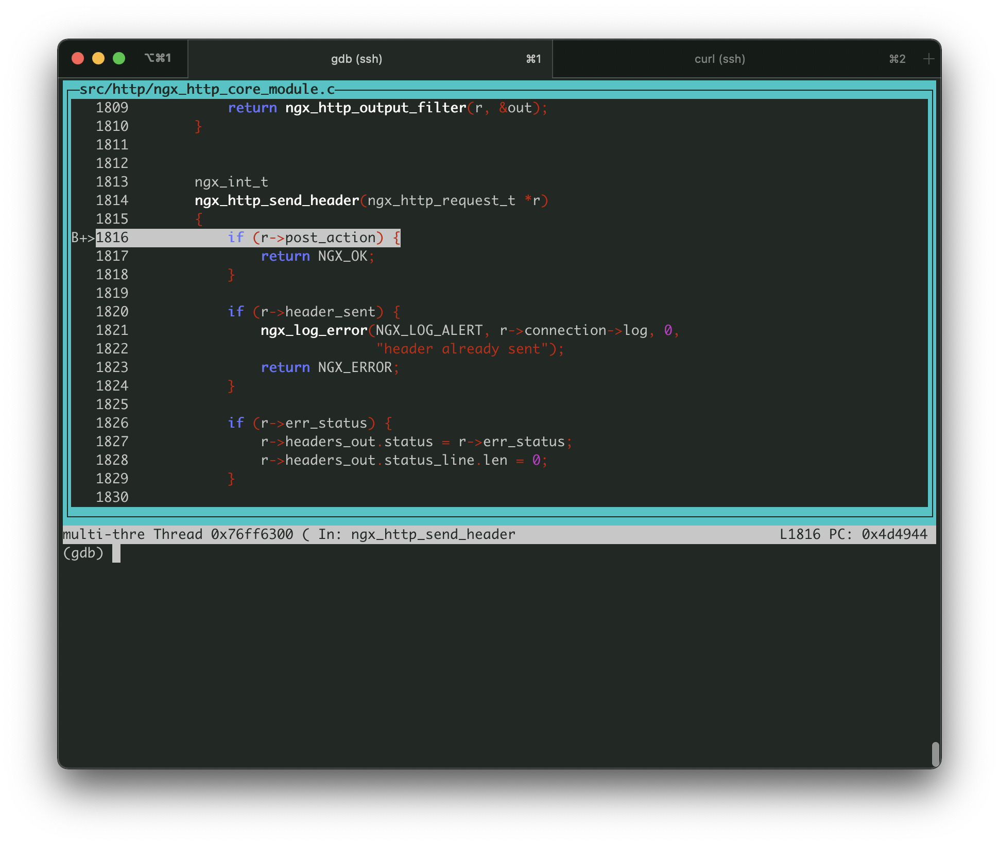

本文主要描述在`CentOS 7`下，使用[gdb](https://www.gnu.org/s/gdb/)调试Nginx

# 1 准备

下载nginx及其依赖项目源码，并解压：

```bash
curl -OL https://mirrors.sohu.com/nginx/nginx-1.19.7.tar.gz
tar zxf nginx-1.19.7.tar.gz
curl -OL https://ftp.pcre.org/pub/pcre/pcre-8.44.tar.gz
tar zxf pcre-8.44.tar.gz
curl -OL http://zlib.net/zlib-1.2.11.tar.gz
tar zxf zlib-1.2.11.tar.gz
```

安装构建工具：

```bash
yum install gcc make
```

构建nginx:

```bash
cd /opt/app/nginx-1.19.7
./configure --with-debug --with-cc-opt='-O0 -g' --with-pcre=/opt/app/pcre-8.44 --with-zlib=/opt/app/zlib-1.2.11 --prefix=/opt/app/nginx
make && make install
```

修改nginx配置文件`/opt/app/nginx/conf/nginx.conf`:

```
# 最好是1，便于断点调试
worker_processes  1;

events {
    worker_connections  1024;
}

http {
    include       mime.types;
    default_type  application/octet-stream;

    sendfile        on;
    keepalive_timeout  65;
    server {
        listen       8000;
        server_name  localhost;

        location / {
            root   html;
            index  index.html index.htm;
        }

        error_page   500 502 503 504  /50x.html;
        location = /50x.html {
            root   html;
        }
    }
}
```

启动：

```bash
/opt/app/nginx/sbin/nginx
```

使用curl访问:

```bash
curl -v localhost:8080
```

若能返回`200 OK`，则已准备好调试环境

# 2 调试

安装调试工具

```bash
yum install gdb
```

找到nginx worker的进程号：

> 为什么是`worker`进程号呢？因为在nginx架构中，进程类型主要是`master`和`worker`两类，前者主要负责配置解析、重载配置、维护work进程组等职责，而后者才是接收、处理来自客户端的连接。更多[移步](2019/01/31/nginx架构.html)

```bash
ps -ef | grep 'nginx: worker process' | grep -v grep
```

例如:

```
[newad@localhost nginx]$ ps -ef | grep 'nginx: worker process' | grep -v grep
newad    12362 12361  0 17:55 ?        00:00:00 nginx: worker process
```

可知进程号是`12362`

用gdb连接上nginx worker进程：

```bash
gdb -p 12362
```

若输出的末尾是`(gdb)`字样，则连接成功

在文件`ngx_http_core_module.c`的`1816`行设置断点：

```
(gdb) break src/http/ngx_http_core_module.c:1816
Breakpoint 1 at 0x4d4944: file src/http/ngx_http_core_module.c, line 1816.
```

继续运行进程：

```
(gdb) continue
Continuing.
```

新开一个ssh会话，使用curl发起访问：

```bash
curl -v localhost:8080
```

回到gdb的会话，可以发现程序在刚刚设置的断点停住了：

```
Breakpoint 1, ngx_http_send_header (r=0x1f7db20) at src/http/ngx_http_core_module.c:1816
1816	    if (r->post_action) {
```

可以通过组合键`ctrl x`和`ctrl a`进入[TUI模式](http://www.cs.fsu.edu/~baker/ada/gnat/html/gdb_23.html)，实现同时查看源代码和控制台，如图：



使用`p`命令，求值（打印）表达式：

```
(gdb) p r->request_line
$2 = {len = 14, data = 0x1f844d8 "GET / HTTP/1.1\r\nHost"}
```

使用`ptype`命令，打印struct或者class的定义：

```
(gdb) ptype ngx_http_request_body_t
type = struct {
    ngx_temp_file_t *temp_file;
    ngx_chain_t *bufs;
    ngx_buf_t *buf;
    off_t rest;
    off_t received;
    ngx_chain_t *free;
    ngx_chain_t *busy;
    ngx_http_chunked_t *chunked;
    ngx_http_client_body_handler_pt post_handler;
}
```

使用`continue`命令，继续运行进程。

# 3 参考

- http://www.cs.fsu.edu/~baker/ada/gnat/html/gdb_23.html
- https://stackoverflow.com/questions/10115540/gdb-split-view-with-code
- https://docs.nginx.com/nginx/admin-guide/monitoring/debugging/#nginx-and-debugging-symbols
- https://stackoverflow.com/questions/1768620/how-do-i-show-what-fields-a-struct-has-in-gdb
